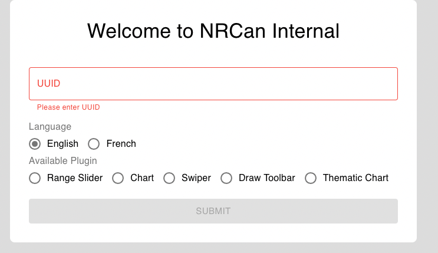
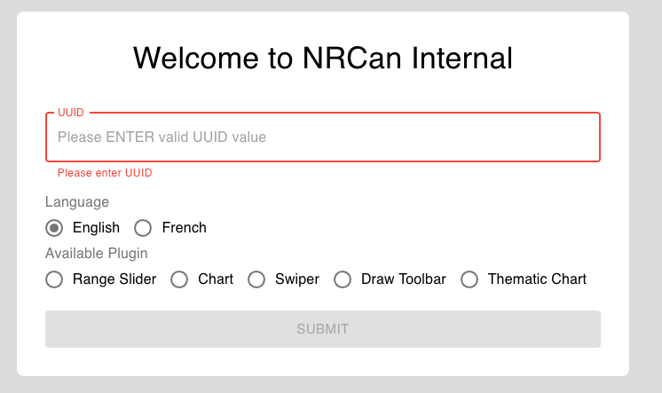
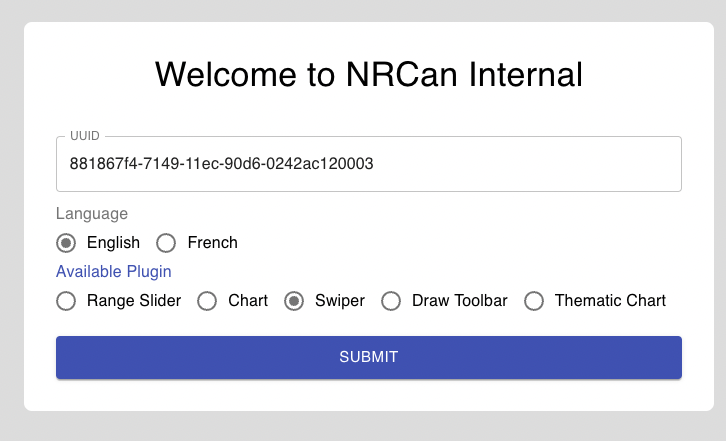

## Project Name & Pitch

GeoView Schema Form
some UUID to test it
# 881867f4-7149-11ec-90d6-0242ac120003
# b87924ac-72ec-11ec-90d6-0242ac120003

[Demo](http://plugin-scema-template-deploybucket-1vj1hgukq0iz4.s3-website.ca-central-1.amazonaws.com/)

This application is build to get user input and render form using schema and submit configuration to AWS bucket, built with React, JavaScript,REST and CSS.

## Project Status
This project is currently in development. Users can give input and generate the form.

## Installation and Setup Instructions

Clone down this repository. 
You will need `node` and `npm` installed globally on your machine.

Installation:
`npm install`

To Start Application:
`npm start`

To Visit App:

`http://localhost:3000/`

## How to Deploy to Github ##

add to package.json the following  "homepage": "https://{githubusername}}.github.io/GeoView-Plugins-Config",

also have to add to App.js 
    <Router basename={process.env.PUBLIC_URL}>

## ESLint config to avoid Errors ## 

ERROR in Plugin "react" was conflicted between ".eslintrc.json" and "BaseConfig" 

THe following  Eslintrc.yml config avoids above error.

    env:
  browser: true
  es2021: true
  es6: true
  node: true
extends:
  - eslint:recommended
 # - plugin:react/recommended
 # - plugin:prettier/recommended
parserOptions:
  ecmaFeatures:
    jsx: true
  ecmaVersion: "latest"
  sourceType: module
#plugins:
#  - react
#  - prettier
rules:
  react/react-in-jsx-scope: off
 # prettier/prettier: error

## Reflection

