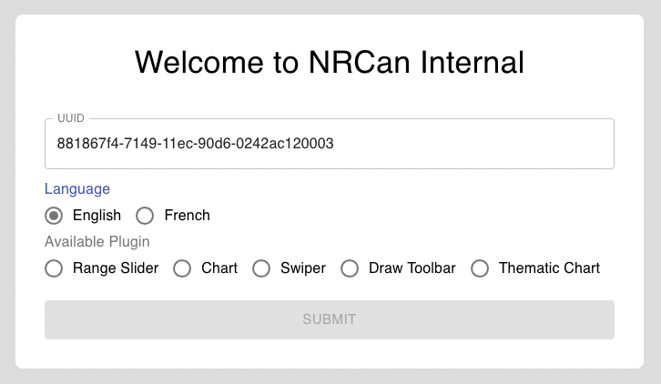
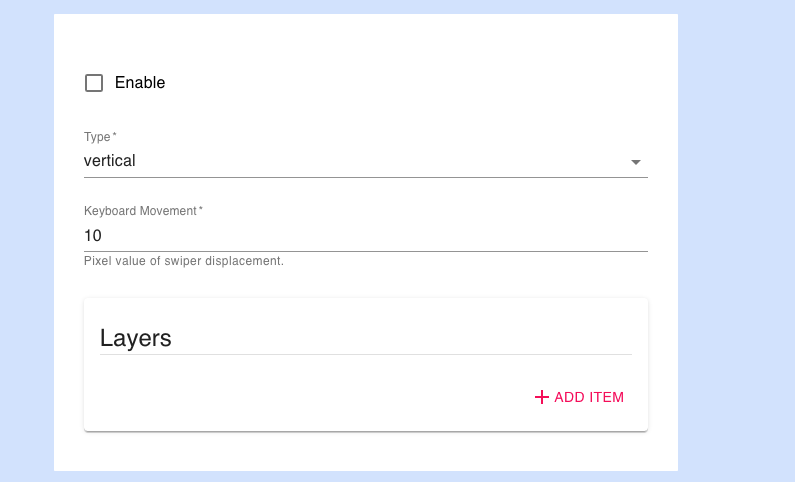

## Project Name & Pitch

GeoView Schema Form

This application is build to get user input and render form using schema and submit configuration to AWS bucket, built with React, JavaScript,REST and CSS.

## Project Status
This project is currently in development. Users can give input and generate the form.

## Installation and Setup Instructions

Clone down this repository. 
You will need `node` and `npm` installed globally on your machine.

Installation:

`npm install`
`npm install -g json-server`

To Start Application:

`npx json-server -p 3500 -w data/db.json `
`npm start`

To Visit App:

`http://localhost:3000/`

## Reflection

